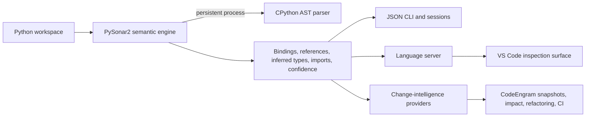

# PySonar2

[](https://github.com/smallyunet/pysonar2/actions/workflows/ci.yml)
[](https://marketplace.visualstudio.com/items?itemName=smallyu.pysonar2-code-intelligence)
[](https://smallyunet.github.io/pysonar2/)
[](LICENSE)

**Whole-project semantic analysis for safe Python changes.**

PySonar2 is a local-first Python semantic engine. It follows values across files and function calls to
produce definitions, references, inferred types, import relationships, diagnostics, and explicit
coverage limitations. Its primary role is to supply auditable language facts for change-impact
analysis, safe refactoring, migration tooling, CI, and code-review infrastructure, especially in large
or lightly annotated Python codebases.

PySonar2 is not positioned as another general-purpose type checker, linter, formatter, or standalone
AI product. It complements those tools and can serve as the Python language provider for higher-level
change-intelligence systems such as
[CodeEngram](https://github.com/smallyunet/code-engram).

The project exposes the engine through several integration surfaces:

- **JSON CLI and sessions:** query stable, machine-readable semantic facts and incremental snapshots.
- **Java integration:** embed the analyzer and consume its semantic index directly.
- **VS Code:** inspect saved-workspace definitions, references, inferred types, symbols, and diagnostics.
- **Static code browser:** generate a self-contained HTML view of a Python project.
- **Experimental agent integration:** let coding tools consume the same local JSON contract without
  making token reduction a product guarantee.

Historically, PySonar2 has been used in large-scale code-indexing systems at Google, Sourcegraph, and
Insight.io (now part of Elastic).

## Try PySonar2

- [Open the interactive code-browser demo](https://smallyunet.github.io/pysonar2/)
- [Install PySonar2 Code Intelligence from the VS Code Marketplace](https://marketplace.visualstudio.com/items?itemName=smallyu.pysonar2-code-intelligence)
- [Download the latest GitHub release](https://github.com/smallyunet/pysonar2/releases/latest)

## What's new

### Core semantics on main

The next core-analysis update strengthens semantic navigation and type flow rather than adding another
integration surface:

- Python C3 method-resolution order for multiple inheritance;
- package re-export, alias, and module-attribute reference coverage;
- annotation-assisted inference that only seeds values when runtime evidence is unknown;
- property value inference while preserving existing classmethod and staticmethod behavior;
- explicit `Awaitable[T]` results for async calls and unwrapped `await` types; and
- a richer generated demo that exposes these capabilities, per-file semantic counts, and responsive
  source navigation.

### PySonar2 3.3

The 3.3 release turns the analyzer into a more reusable semantic-change provider:

- compact `plan` responses for one or more symbols and `inspect` or `change` intent;
- persistent JSONL `session` mode with explicit atomic snapshot refresh;
- exact semantic candidates with clearly labeled identifier-text fallback when reference coverage is incomplete;
- content-hash and reverse-import incremental rebuilds; and
- reproducible benchmarks that separate analyzer behavior, integration overhead, correctness, and token use.

### PySonar2 3.2

The 3.2 release extends the Python 3.10+ baseline through modern Python 3.11-3.14 syntax while preserving
the whole-project analysis model:

- parsing through the selected CPython interpreter in a persistent process;
- exception groups, PEP 695 type aliases and generic parameters, type-parameter defaults, and template strings;
- class decorators, metaclass keywords, modern raise causes and exception binders, and async comprehensions;
- traversal fallback for newer CPython AST nodes, so recognized child expressions remain indexed;
- focused compatibility coverage across Python 3.10-3.14 and Java 11, 17, and 21 in CI;
- a responsive, self-contained static code-browser demo; and
- an explicit [Python support matrix](docs/python-support.md) separating inference, navigation, and
  traversal-only coverage.

### VS Code extension 0.2.3

[PySonar2 Code Intelligence](https://marketplace.visualstudio.com/items?itemName=smallyu.pysonar2-code-intelligence)
bundles the 3.3 analyzer in a Java Language Server with a TypeScript VS Code client providing:

- go to definition and find all references;
- inferred-type and docstring hovers;
- document and workspace symbols;
- conservative semantic diagnostics that suppress unknown-type cascades;
- one isolated server per workspace folder;
- save-triggered workspace reindexing with atomic snapshots;
- detailed discovery and file-level indexing progress; and
- automatic nested Python project/package-root discovery;
- configurable Java, Python, server, diagnostics, and exclusion settings.

The server JAR is bundled in the extension. There is no hosted PySonar2 service to deploy: analysis runs
where the VS Code workspace extension runs. For Remote SSH, Java and Python must therefore be available
on the remote machine.

## Install the VS Code extension

Install **PySonar2 Code Intelligence** from the
[Visual Studio Marketplace](https://marketplace.visualstudio.com/items?itemName=smallyu.pysonar2-code-intelligence),
search for it in VS Code, or run:

```sh
code --install-extension smallyu.pysonar2-code-intelligence
```

Requirements:

- VS Code 1.91+
- Java 11+
- Python 3.10+

The extension uses `java` and `python3` from `PATH` by default. You can select other executables through
`pysonar2.java.command` and `pysonar2.python.path`. PySonar2 complements existing Python extensions; it
does not replace formatting, debugging, completion, or environment management.

Indexing progress includes the current path, percentage, elapsed time, and JVM heap usage. Large
multi-project workspaces can be narrowed with `pysonar2.analysis.exclude`; an optional
`pysonar2.java.maxHeapMb` setting is available for projects that must be analyzed as one unit.

See the [VS Code extension guide](editors/vscode/README.md) for commands, settings, development setup,
packaging, and current limitations.

## Experimental coding-tool integration

PySonar2 includes a filesystem-based Agent Skill for Codex, Claude Code, GitHub Copilot, Gemini CLI, and
Cursor. This is an experimental consumer of the semantic engine, not PySonar2's primary product
identity. The Skill teaches a tool when a bounded semantic query may replace uncertain source
exploration; all analysis remains in the local CLI, with one JSON object written to stdout and progress
or errors written to stderr.

Install the CLI with Homebrew on macOS or Linux:

```sh
brew install smallyunet/tap/pysonar2
pysonar --version
pysonar doctor --format json
```

Or build the CLI bundle from source:

```sh
mvn package
unzip target/pysonar-cli-3.3.5.zip
export PATH="$PWD/pysonar-cli-3.3.5/bin:$PATH"
pysonar doctor --format json
```

Install the Skill for the current user. The portable target uses the shared `~/.agents/skills` location:

```sh
pysonar skill install --agent portable --scope user
```

Use a tool-specific target when the coding agent does not read the portable location:

```sh
pysonar skill install --agent claude --scope user
pysonar skill install --agent copilot --scope user
pysonar skill install --agent cursor --scope user
```

Supported targets and destinations are:

| Target | User scope | Project scope |
| --- | --- | --- |
| `portable`, `codex`, `gemini` | `~/.agents/skills` | `.agents/skills` |
| `claude` | `~/.claude/skills` | `.claude/skills` |
| `copilot` | `~/.copilot/skills` | `.github/skills` |
| `cursor` | `~/.cursor/skills` | `.cursor/skills` |

Run `skill update`, `skill doctor`, or `skill uninstall` with the same `--agent` and `--scope` options
to manage an installation. PySonar2 records file hashes and refuses to overwrite or remove a Skill that
has been modified locally.

The machine-readable analysis commands are:

```sh
pysonar plan --root . --symbol Handler --intent change --max-results 8 --format compact-json
pysonar context --root . --file app.py --line 42 --character 8 --format json
pysonar impact --root . --file app.py --line 42 --character 8 --format json
pysonar check --root . --changed app.py --format json
```

`context` and `impact` report an explicit analysis-completeness contract. The response includes
`coverageStatus`, `applicable`, `confidence`, and a `coverage` object with discovered/parsed file counts,
failed paths, unsupported AST node types, and detected framework-injected symbols. Queries for known
pytest fixtures report `pytest-fixture-parameter-injection` in `unsupportedSemantics` and are not
applicable as complete impact boundaries. A partial `context` can still support local inspection;
`impact.applicable` is false unless the query resolves and the full discovered workspace was analyzed.
Treat an inapplicable impact result as evidence to investigate, not as a complete safe-change boundary.

`plan` resolves one or more repeated symbol names with a single analysis and returns compact definitions,
references, snippets, and affected files for agent change planning. `context` returns inferred hover
information, definitions, references, and small source snippets.
`impact` adds the affected-file set and explicitly reports that its coverage is reference-based rather
than a complete runtime call graph. `check` returns conservative diagnostics for the whole project or
the paths selected with repeated or comma-separated `--changed` options; it is intended for cases where
focused project validation is unavailable, not as a mandatory post-edit step.

For several semantic decisions in one agent task, keep an immutable analysis snapshot alive with the
JSONL session protocol:

```sh
pysonar session --root . --format json
{"command":"plan","symbol":["Handler","Registry"],"intent":"change","maxResults":8}
{"command":"refresh"}
{"command":"quit"}
```

The session emits a `session-ready` object before accepting requests. `plan` requests reuse the current
snapshot; send `refresh` after saved edits. Refresh compares content hashes, rebuilds the changed files
and their transitive reverse-import dependents, and atomically publishes the merged snapshot. If import
syntax cannot be modeled conservatively, it falls back to a full rebuild. Responses include the rebuild
mode, changed/affected/analyzed counts, reason, and AST-cache hit/miss counters.

The canonical Skill source is [`skills/pysonar-code-intelligence`](skills/pysonar-code-intelligence).
The CLI embeds that same directory in the packaged JAR, so installs and updates stay aligned with the
CLI version. The public `SKILL.md` uses only portable `name` and `description` frontmatter; optional
Codex UI metadata lives separately under `agents/openai.yaml`.

### Coding-tool integration benchmark

The reproducible benchmark under [`benchmarks/agent-skill`](benchmarks/agent-skill) treats agent use as
an integration experiment rather than the product definition. A 2026-08-05 always-off versus always-on
comparison passed all 14 hidden validators, reduced captured source-reading output by 45.2%, but used
18.0% more total model tokens when PySonar2 was mandatory. The result shows that fewer source bytes do
not automatically offset an additional tool round trip and context replay. Token efficiency is therefore
a secondary, workload-dependent outcome, not a general PySonar2 claim. See the
[`full method, result table, and limitations`](docs/agent-skill-benchmark.md).

### Historical change-safety benchmark

The reproducible benchmark under [`benchmarks/change-safety`](benchmarks/change-safety) replays 12
identifier changes from pinned Click, Flask, and Werkzeug commits against PySonar2, Jedi, Rope, and
exact-name search. The first pilot is intentionally retained as a negative baseline: PySonar2 returned
high-precision evidence and exactly reproduced four changes, but its 0.479 reference recall did not
beat exact-name search overall. See the
[`method, results, valid claims, and next gates`](docs/change-safety-benchmark.md).

## Product boundary

PySonar2 owns Python-specific semantic truth: parsing, binding resolution, value and type inference,
definitions, references, import relationships, incremental invalidation, confidence, and limitations.
Higher-level products should own versioned change comparison, safe write plans, policy, review UX, and
cross-language orchestration. The intended boundary and success criteria are documented in
[`docs/product-positioning.md`](docs/product-positioning.md).

## Generate a static code browser

Build PySonar2 and analyze the included multi-file demo:

```sh
mvn package
java -jar target/pysonar-3.3.5.jar demo_project ./demo-html
```

Open `demo-html/index.html` in a browser. Hover over or focus a symbol to inspect its inferred type, and
follow links between definitions and references. The generated site has no runtime server dependency and
can be hosted on any static file server.

Use the same command with another Python file or directory to analyze your own code:

```sh
java -jar target/pysonar-3.3.5.jar /path/to/python/project ./demo-html
```

Large source trees, such as a Python standard library, may take several minutes to analyze.

## Architecture



The analyzer performs whole-project interprocedural analysis and supports first-class functions,
closures, imports, and control flow. The Language Server translates its completed index into standard
LSP responses while keeping analysis work outside the VS Code extension host.

## Build and test

### Analyzer and Language Server

```sh
mvn test
mvn package
```

The shaded JAR contains both the static-browser entry point and the Language Server implementation.

### VS Code extension

```sh
cd editors/vscode
npm ci
npm run check
npm run build
npm run smoke
npm run package
```

`npm run smoke` starts the packaged Java server over real stdio JSON-RPC, indexes `demo_project`, and
checks cross-file definition resolution. `npm run package` produces
`editors/vscode/pysonar2-code-intelligence.vsix`.

To run the interactive extension demo, open `editors/vscode` in VS Code, press `F5`, and choose
**Run PySonar2 Extension Demo**. The Extension Development Host opens `demo_project` automatically.

## Runtime configuration

PySonar2 uses CPython's built-in `ast` module. By default it launches `python3`; select another supported
interpreter with:

```sh
export PYSONAR_PYTHON=/path/to/python3
```

`PYTHONPATH` is used to locate Python libraries. Point it at the library tree that belongs to the
selected interpreter when you want references into those libraries to resolve:

```sh
export PYTHONPATH=/usr/lib/python3
```

## Repository layout

| Path | Purpose |
| --- | --- |
| `src/main/java/org/yinwang/pysonar` | Analyzer, AST, type system, demos, and Language Server |
| `src/test/java/org/yinwang/pysonar` | Parser, inference, traversal, demo, and LSP tests |
| `editors/vscode` | Published VS Code extension and VSIX build tooling |
| `demo_project` | Shared multi-file demo for the static browser and VS Code extension |
| `benchmarks/agent-skill` | Reproducible analyzer-integration and routing experiments |
| `benchmarks/analyzer` | Auditable analyzer timing, allocation counters, and JFR profiling |
| `benchmarks/change-safety` | Historical rename replay against PySonar2, Jedi, Rope, and exact-name search |
| `docs/python-support.md` | Python syntax and semantic support contract |
| `docs/product-positioning.md` | Product role, integration boundary, users, non-goals, and success metrics |

## Current limitations

- Python syntax accepted by CPython does not automatically have complete PySonar2 type semantics; consult
  the [support matrix](docs/python-support.md).
- The VS Code extension analyzes the last saved workspace state. Unsaved-buffer overlays are not yet
  implemented.
- Incremental invalidation follows static imports. Dynamic imports are conservatively connected to all
  workspace modules, and unsupported continued-import syntax falls back to a full rebuild.
- The extension requires a desktop or remote extension host and cannot run as a browser-only web
  extension.
- Standard-library models and several newer Python semantic features remain conservative.
- Direct `@pytest.fixture` declarations are detected and reported as unsupported dynamic parameter
  injection; alias-based or plugin-defined fixture mechanisms may still require manual review.

## Contributing

Contributions are welcome. Because small analyzer changes can have broad inference effects, please open
an issue before undertaking a large semantic change and add focused parser, inference, or reference tests
for new AST behavior.

To regenerate legacy inference fixtures after an intentional semantic change:

```sh
mvn package -DskipTests
java -classpath target/pysonar-3.3.5.jar org.yinwang.pysonar.TestInference -generate tests
```

Test cases live under directories whose names end in `.test`; existing cases in `tests` provide examples.

## License

PySonar2 is available under the [Apache License 2.0](LICENSE).
