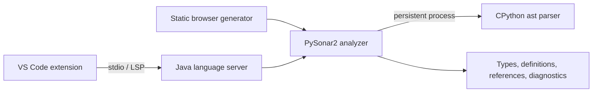

# PySonar2

[](https://github.com/smallyunet/pysonar2/actions/workflows/ci.yml)
[](https://marketplace.visualstudio.com/items?itemName=smallyu.pysonar2-code-intelligence)
[](https://smallyunet.github.io/pysonar2/)
[](LICENSE)

PySonar2 is a whole-project type inferencer and semantic indexer for Python. It follows values across
files and function calls to locate definitions, references, and inferred types, making it suitable for
IDEs, code browsers, and code-search infrastructure.

The project now includes three ways to use the analyzer:

- **VS Code:** install the published extension for navigation, hovers, symbols, and diagnostics.
- **Static code browser:** generate a self-contained HTML view of a Python project.
- **Java integration:** embed the analyzer and consume its semantic index directly.

Historically, PySonar2 has been used in large-scale code-indexing systems at Google, Sourcegraph, and
Insight.io (now part of Elastic).

## Try PySonar2

- [Open the interactive code-browser demo](https://smallyunet.github.io/pysonar2/)
- [Install PySonar2 Code Intelligence from the VS Code Marketplace](https://marketplace.visualstudio.com/items?itemName=smallyu.pysonar2-code-intelligence)
- [Download the latest GitHub release](https://github.com/smallyunet/pysonar2/releases/latest)

## What's new

### PySonar2 3.1

The 3.1 modernization moves the supported baseline to Python 3.10+ and Java 11+ while preserving the
whole-project analysis model:

- parsing through the selected CPython interpreter in a persistent process;
- positional-only and keyword-only parameters, annotations, assignment expressions, f-strings,
  structural pattern matching, and modern async syntax;
- traversal fallback for newer CPython AST nodes, so recognized child expressions remain indexed;
- focused compatibility coverage across Python 3.10-3.14 and Java 11, 17, and 21 in CI;
- a responsive, self-contained static code-browser demo; and
- an explicit [Python support matrix](docs/python-support.md) separating inference, navigation, and
  traversal-only coverage.

### VS Code extension 0.1.3

[PySonar2 Code Intelligence](https://marketplace.visualstudio.com/items?itemName=smallyu.pysonar2-code-intelligence)
is the first stable Marketplace release. It adds a Java Language Server and a TypeScript VS Code client
with:

- go to definition and find all references;
- inferred-type and docstring hovers;
- document and workspace symbols;
- conservative semantic diagnostics that suppress unknown-type cascades;
- one isolated server per workspace folder;
- save-triggered workspace reindexing with atomic snapshots;
- detailed discovery and file-level indexing progress; and
- automatic nested Python project/package-root discovery; and
- configurable Java, Python, server, diagnostics, and exclusion settings.

The server JAR is bundled in the extension. There is no hosted PySonar2 service to deploy: analysis runs
where the VS Code workspace extension runs. For Remote SSH, Java and Python must therefore be available
on the remote machine.

## Install the VS Code extension

Install **PySonar2 Code Intelligence** from the
[Visual Studio Marketplace](https://marketplace.visualstudio.com/items?itemName=smallyu.pysonar2-code-intelligence),
search for it in VS Code, or run:

```sh
code --install-extension smallyu.pysonar2-code-intelligence
```

Requirements:

- VS Code 1.91+
- Java 11+
- Python 3.10+

The extension uses `java` and `python3` from `PATH` by default. You can select other executables through
`pysonar2.java.command` and `pysonar2.python.path`. PySonar2 complements existing Python extensions; it
does not replace formatting, debugging, completion, or environment management.

Indexing progress includes the current path, percentage, elapsed time, and JVM heap usage. Large
multi-project workspaces can be narrowed with `pysonar2.analysis.exclude`; an optional
`pysonar2.java.maxHeapMb` setting is available for projects that must be analyzed as one unit.

See the [VS Code extension guide](editors/vscode/README.md) for commands, settings, development setup,
packaging, and current limitations.

## Generate a static code browser

Build PySonar2 and analyze the included multi-file demo:

```sh
mvn package
java -jar target/pysonar-3.1.2.jar demo_project ./demo-html
```

Open `demo-html/index.html` in a browser. Hover over or focus a symbol to inspect its inferred type, and
follow links between definitions and references. The generated site has no runtime server dependency and
can be hosted on any static file server.

Use the same command with another Python file or directory to analyze your own code:

```sh
java -jar target/pysonar-3.1.2.jar /path/to/python/project ./demo-html
```

Large source trees, such as a Python standard library, may take several minutes to analyze.

## Architecture



The analyzer performs whole-project interprocedural analysis and supports first-class functions,
closures, imports, and control flow. The Language Server translates its completed index into standard
LSP responses while keeping analysis work outside the VS Code extension host.

## Build and test

### Analyzer and Language Server

```sh
mvn test
mvn package
```

The shaded JAR contains both the static-browser entry point and the Language Server implementation.

### VS Code extension

```sh
cd editors/vscode
npm ci
npm run check
npm run build
npm run smoke
npm run package
```

`npm run smoke` starts the packaged Java server over real stdio JSON-RPC, indexes `demo_project`, and
checks cross-file definition resolution. `npm run package` produces
`editors/vscode/pysonar2-code-intelligence.vsix`.

To run the interactive extension demo, open `editors/vscode` in VS Code, press `F5`, and choose
**Run PySonar2 Extension Demo**. The Extension Development Host opens `demo_project` automatically.

## Runtime configuration

PySonar2 uses CPython's built-in `ast` module. By default it launches `python3`; select another supported
interpreter with:

```sh
export PYSONAR_PYTHON=/path/to/python3
```

`PYTHONPATH` is used to locate Python libraries. Point it at the library tree that belongs to the
selected interpreter when you want references into those libraries to resolve:

```sh
export PYTHONPATH=/usr/lib/python3
```

## Repository layout

| Path | Purpose |
| --- | --- |
| `src/main/java/org/yinwang/pysonar` | Analyzer, AST, type system, demos, and Language Server |
| `src/test/java/org/yinwang/pysonar` | Parser, inference, traversal, demo, and LSP tests |
| `editors/vscode` | Published VS Code extension and VSIX build tooling |
| `demo_project` | Shared multi-file demo for the static browser and VS Code extension |
| `docs/python-support.md` | Python syntax and semantic support contract |

## Current limitations

- Python syntax accepted by CPython does not automatically have complete PySonar2 type semantics; consult
  the [support matrix](docs/python-support.md).
- The VS Code extension analyzes the last saved workspace state. Unsaved-buffer overlays are not yet
  implemented.
- VS Code reindexing is whole-workspace rather than dependency-graph incremental.
- The extension requires a desktop or remote extension host and cannot run as a browser-only web
  extension.
- Standard-library models and several newer Python semantic features remain conservative.

## Contributing

Contributions are welcome. Because small analyzer changes can have broad inference effects, please open
an issue before undertaking a large semantic change and add focused parser, inference, or reference tests
for new AST behavior.

To regenerate legacy inference fixtures after an intentional semantic change:

```sh
mvn package -DskipTests
java -classpath target/pysonar-3.1.2.jar org.yinwang.pysonar.TestInference -generate tests
```

Test cases live under directories whose names end in `.test`; existing cases in `tests` provide examples.

## License

PySonar2 is available under the [Apache License 2.0](LICENSE).
