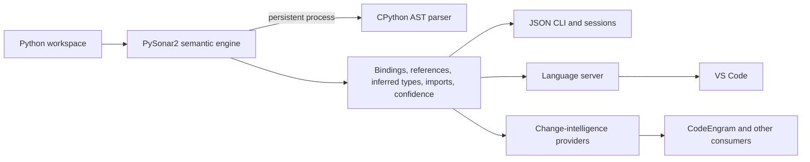

# PySonar2

[](https://github.com/smallyunet/pysonar2/actions/workflows/ci.yml)
[](https://marketplace.visualstudio.com/items?itemName=smallyu.pysonar2-code-intelligence)
[](https://smallyunet.github.io/pysonar2/)
[](LICENSE)

**Whole-project semantic analysis for safe Python changes.**

PySonar2 is a local-first Python semantic engine. It follows values across files and function calls to
produce definitions, references, inferred types, import relationships, diagnostics, and explicit
coverage limitations. It is designed to supply auditable language facts for change-impact analysis,
refactoring, migration tooling, CI, and code review, especially in large or lightly annotated projects.

It complements type checkers, linters, formatters, and higher-level change-intelligence systems rather
than replacing them. The [original PySonar2 project](https://github.com/yinwang0/pysonar2#readme) listed
Google, Sourcegraph, and Insight.io among its historical users; this repository modernizes the engine
for current Python, editor, CLI, and automation workflows.

## Capabilities

- Whole-project interprocedural inference across imports, calls, closures, and control flow.
- Definitions, references, inferred types, symbols, diagnostics, and import relationships.
- Modern Python 3.10-3.14 parsing with an explicit [semantic support matrix](docs/python-support.md).
- C3 method resolution, package re-exports, properties, annotations, async results, decorators, pattern
  captures, and other modern navigation flows.
- Atomic incremental snapshots with content-hash caching and reverse-import invalidation.
- Machine-readable coverage, confidence, truncation, and unsupported-semantics reporting.

## Quick start

### CLI

Install the self-contained CLI bundle with Homebrew on macOS or Linux:

```sh
brew install smallyunet/tap/pysonar2
pysonar --version
pysonar doctor --format json
```

Prebuilt artifacts are available from the
[latest GitHub release](https://github.com/smallyunet/pysonar2/releases/latest). To build locally, see
[Build and test](#build-and-test).

### VS Code

Install [PySonar2 Code Intelligence](https://marketplace.visualstudio.com/items?itemName=smallyu.pysonar2-code-intelligence)
from the Marketplace or run:

```sh
code --install-extension smallyu.pysonar2-code-intelligence
```

The extension provides saved-workspace definitions, references, inferred-type hovers, symbols, and
conservative diagnostics. It requires VS Code 1.91+, Java 11+, and Python 3.10+. See the
[extension guide](editors/vscode/README.md) for settings, workspace behavior, and development setup.

### Interactive demo

[Open the generated code browser](https://smallyunet.github.io/pysonar2/) to explore cross-file
definitions, references, types, inheritance, decorators, modern syntax, and async flows. The complete
example corpus and local instructions live in [`demo_project`](demo_project/README.md).

## Semantic queries

Use `plan` when a symbol is known and `context` or `impact` when a source position is known:

```sh
pysonar plan --root . --symbol Handler --intent change --max-results 8 --format compact-json
pysonar context --root . --file app.py --line 42 --character 8 --format json
pysonar impact --root . --file app.py --line 42 --character 8 --format json
pysonar check --root . --changed app.py --format json
```

`context` and `impact` report `coverageStatus`, `applicable`, `confidence`, discovered and parsed file
counts, failed paths, unsupported AST nodes, and detected framework-injected symbols. An inapplicable
impact result is evidence to investigate, not a complete safe-change boundary. Impact is based on
definitions and references; it is not a complete runtime call graph.

For several queries in one task, `session` keeps an immutable analysis snapshot alive and supports an
explicit atomic refresh after saved edits. The full JSON contract is documented in the
[CLI schema](skills/pysonar-code-intelligence/references/cli-schema.md).

## Coding-agent integration

PySonar2 includes an experimental filesystem-based Skill for Codex, Claude Code, GitHub Copilot,
Gemini CLI, and Cursor. Install the portable user-level target with:

```sh
pysonar skill install --agent portable --scope user
```

The Skill helps an agent use bounded semantic queries when direct source search cannot resolve
cross-file uncertainty. It does not make token reduction or automated-refactoring safety a product
guarantee. See the [canonical Skill](skills/pysonar-code-intelligence/SKILL.md) for routing guidance and
the CLI help for agent-specific installation targets.

## Evidence and boundaries

- The [coding-tool benchmark](docs/agent-skill-benchmark.md) found that forced analyzer use reduced
  captured source-reading output but increased total model tokens in its pilot. Efficiency is
  workload-dependent; correctness, coverage, and confidence remain the primary goals.
- The [historical change-safety benchmark](docs/change-safety-benchmark.md) found high-precision
  reference evidence but insufficient recall for a general safe-rename claim.
- PySonar2 owns Python-specific semantic facts and limitations. Versioned diffs, write plans, policy,
  review UX, and cross-language orchestration belong in higher-level systems. See
  [product positioning](docs/product-positioning.md).

## Static code browser

Generate a self-contained site for the included demo or another Python project:

```sh
pysonar demo_project ./demo-html
pysonar /path/to/python/project ./demo-html
```

Open `demo-html/index.html`; no runtime server is required. Source-build instructions and guided
examples are in the [demo guide](demo_project/README.md).

## Architecture



## Documentation

| Topic | Guide |
| --- | --- |
| Python syntax and semantic coverage | [Python support](docs/python-support.md) |
| Product role and non-goals | [Product positioning](docs/product-positioning.md) |
| CLI response contract | [CLI schema](skills/pysonar-code-intelligence/references/cli-schema.md) |
| VS Code commands and settings | [VS Code extension](editors/vscode/README.md) |
| Static and editor demo | [Demo project](demo_project/README.md) |
| Coding-tool experiment | [Agent benchmark](docs/agent-skill-benchmark.md) |
| Historical rename replay | [Change-safety benchmark](docs/change-safety-benchmark.md) |
| Analyzer performance | [Analyzer benchmark](benchmarks/analyzer/README.md) |

## Build and test

Build and test the analyzer and Language Server:

```sh
mvn test
mvn package
```

Validate and package the VS Code extension:

```sh
cd editors/vscode
npm ci
npm run check
npm run build
npm run smoke
npm run package
```

PySonar2 uses CPython's built-in `ast` module and launches `python3` by default. Set
`PYSONAR_PYTHON=/path/to/python3` to select another supported interpreter. `PYTHONPATH` can point to
libraries that should participate in reference resolution.

## Current limitations

- Syntax accepted by CPython does not automatically have complete PySonar2 type semantics; consult the
  [support matrix](docs/python-support.md).
- Editor results describe the last saved workspace state; unsaved-buffer overlays are not implemented.
- Impact is reference-based and may omit reflection, monkey patching, unresolved types, and other
  dynamic behavior.
- Static imports drive incremental invalidation. Dynamic or unsupported imports use conservative
  connections or a full rebuild.
- Direct pytest fixtures are detected as unsupported parameter injection; aliases and plugin-defined
  mechanisms may still require manual review.
- Standard-library models and several newer Python semantic features remain conservative.

## Contributing

Contributions are welcome. Small analyzer changes can have broad inference effects, so discuss large
semantic changes first and add focused parser, inference, or reference tests for new behavior. Legacy
inference cases live in directories ending in `.test`; the existing [`tests`](tests) tree provides
examples.

## License

PySonar2 is available under the [Apache License 2.0](LICENSE).
